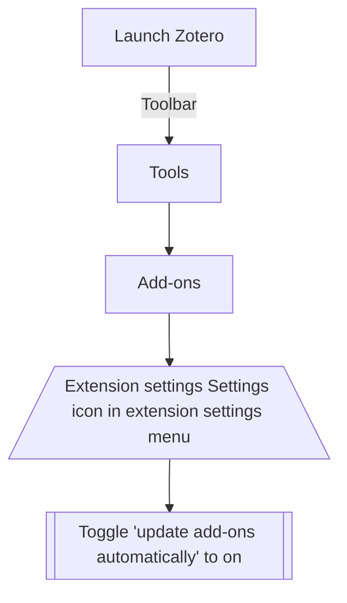

```mermaid
flowchart TD
	start[Launch Zotero]--	Toolbar --> Tools --> Add-ons --> B[/Extension settings Settings icon in extension settings menu \]
	B --> C[[Toggle 'update add-ons automatically' to on]]
	
```